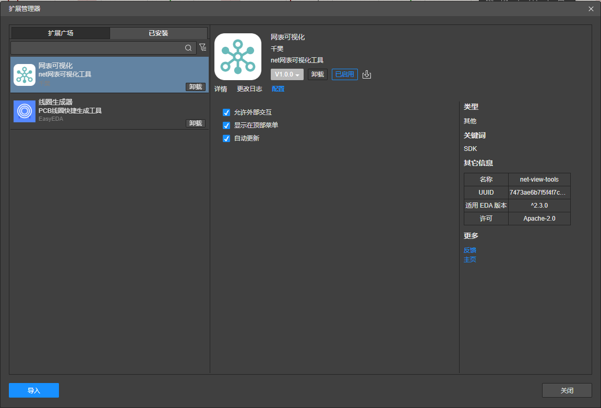
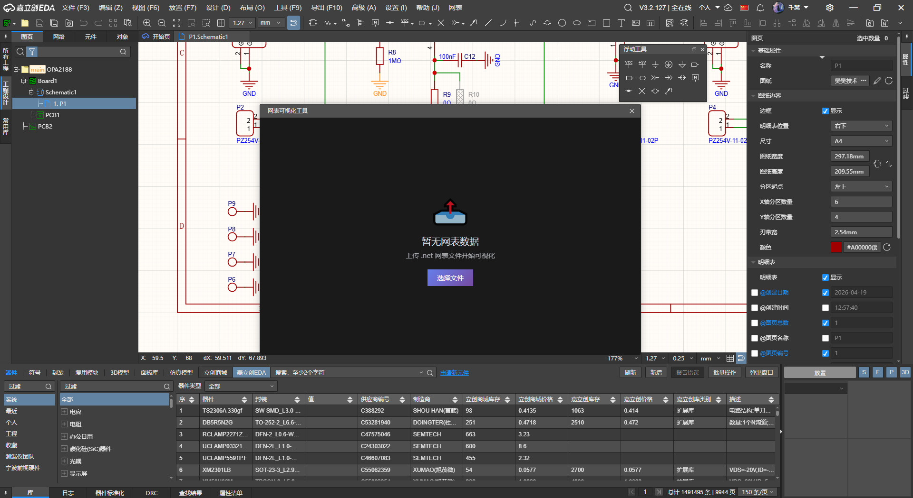
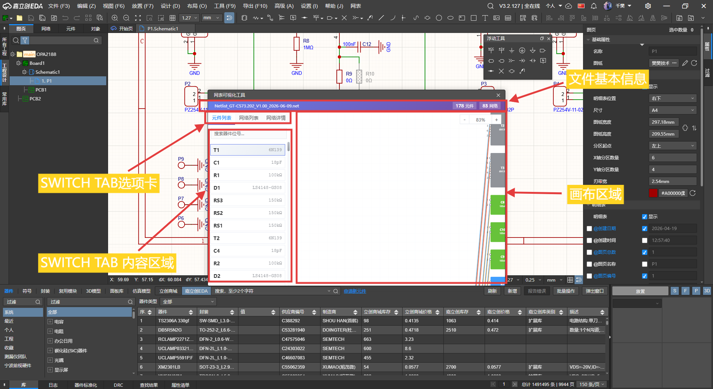
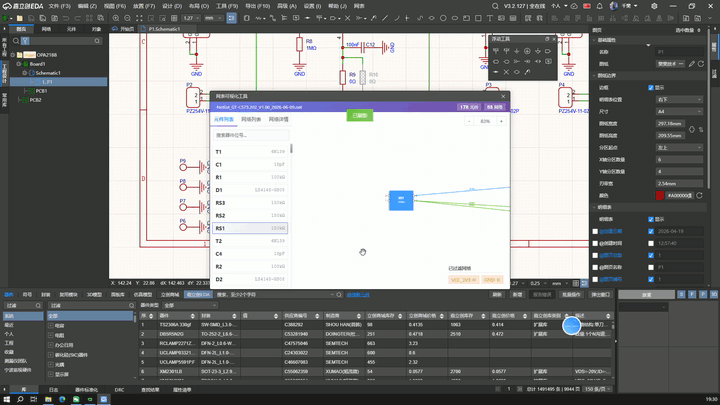
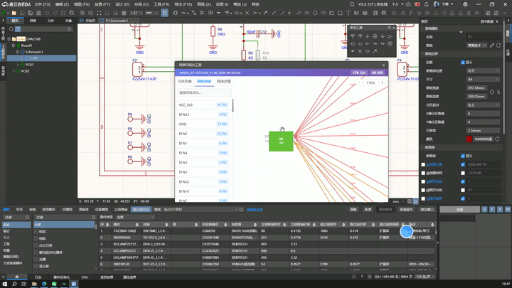
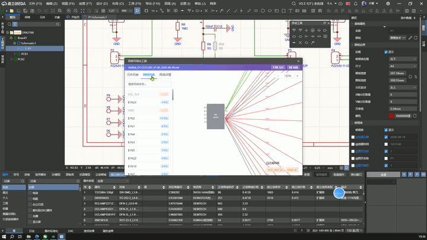

## 网表可视化工具

---

### 简介

网表可视化工具是一个用于电子设计自动化（EDA）领域的网表文件可视化插件。该工具能够解析网表文件，将电子元件和网络连接关系以图形化方式展示，帮助工程师直观地理解电路结构。（说人话：PCB推原理图抄板方便）

### 功能特性

- **文件概览**：顶部标题栏显示当前打开的文件名、元件数量和网络数量
- **元件列表**：展示所有器件列表，支持搜索功能
- **网络列表**：展示所有网络列表，支持搜索和过滤功能
- **网络详情**：显示选中网络的详细信息，包括网络名称、引脚数量和引脚列表
- **绘图区域**：交互式画布，可视化展示元件和网络连接关系
- **缩放控制**：支持放大/缩小操作，显示当前缩放百分比
- **过滤网络**：支持过滤指定网络，已过滤网络标签显示在绘图区域右下角

### 技术实现

- **前端技术栈**：HTML5、CSS3、JavaScript（ES6+）
- **图形渲染**：Canvas 2D API
- **布局方案**：Flexbox 弹性布局
- **样式特点**：渐变色标题栏、透明背景控制按钮、响应式设计

### 使用说明

1. 将插件安装到本地之后，点击配置，勾选三个复选框
   
2. 打开网表插件，进入网表可视化页面，点击选择文件，选择.net网表文件
   
3. 页面框架如下
    
4. 点击左侧的元器件列表即可画布居中显示元器件及其连接关系，鼠标左键按住可拖动画布，滚轮可缩放
   
4. 点击网络列表中的网络可查看网络列表或进行过滤，过滤的网络会显示在画布右下角
   
5. 切换到网络详情，在画布中点击网络可高亮网络，并在在网络详情的页面中显示该网络连接的所有器件
   

### 界面布局

- **顶部标题栏**：渐变背景，显示工具名称、文件名和统计信息
- **左侧面板**：三个标签页（元件列表、网络列表、网络详情）
- **右侧绘图区域**：主画布区域，展示可视化的电路连接图

---

_网表可视化工具 - EDA 扩展插件_
